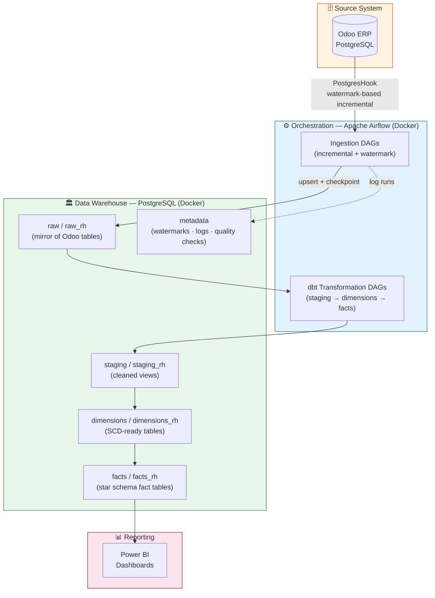

# 📊 Odoo ERP → Data Warehouse — Production ELT Pipeline

[](https://airflow.apache.org/)
[](https://www.getdbt.com/)
[](https://www.postgresql.org/)
[](https://docs.docker.com/compose/)
[](https://www.python.org/)
[](https://powerbi.microsoft.com/)
[](LICENSE)

> **Production-grade ELT pipeline** extracting CRM, Sales and HR data from an Odoo ERP instance into a PostgreSQL Data Warehouse, orchestrated with Apache Airflow and transformed with dbt into a dimensional Star Schema consumed by Power BI.

---

## 📋 Table of Contents

- [Architecture](#architecture)
- [Data Domains](#data-domains)
- [Technical Challenges & Solutions](#technical-challenges--solutions)
- [Star Schema Modeling](#star-schema-modeling)
- [Project Structure](#project-structure)
- [Quick Start](#quick-start)
- [DAG Overview](#dag-overview)
- [dbt Models](#dbt-models)
- [Data Quality Gates](#data-quality-gates)
- [CI/CD](#cicd)

---

## Architecture



### Component Overview

| Component | Technology | Role |
|-----------|-----------|------|
| **Source** | Odoo 16 (PostgreSQL) | ERP — CRM, Sales Orders, HR |
| **Orchestrator** | Apache Airflow 2.6 (Docker) | DAG scheduling, retry logic, alerting |
| **Transformation** | dbt 1.8 + dbt-utils | Staging → Dimensions → Facts |
| **Data Warehouse** | PostgreSQL 15 (Docker) | Star schema, metadata tracking |
| **Reporting** | Power BI | Executive dashboards (CRM + HR) |
| **Infrastructure** | Docker Compose | Reproducible local + server deployment |

---

## Data Domains

### 🛒 Commercial Domain (CRM & Sales)

Tracks the full sales funnel from CRM lead creation through signed sales orders.

**Key source tables:** `crm_lead`, `sale_order`, `res_partner`, `res_users`, `crm_team`, `crm_stage`, `crm_lost_reason`

### 👥 HR Domain

Covers employee lifecycle: contracts, leave management, and workforce composition.

**Key source tables:** `hr_employee`, `hr_contract`, `hr_leave`, `hr_job`, `hr_department`, `hr_leave_type`, `hr_contract_type`

---

## Technical Challenges & Solutions

### 1. Incremental Extraction at Scale — Watermark Pattern

**Problem:** Odoo tables like `mail_message` and `hr_leave` contain millions of rows. A daily full reload was not viable.

**Solution:** Implemented a **dual-mode extraction engine**:

```
┌─────────────────────────────────────────────────────────┐
│                  Extraction Decision Logic               │
│                                                         │
│  Table exists in DW?  ──No──► FULL LOAD                 │
│         │                                               │
│        Yes                                              │
│         │                                               │
│  Watermark exists?  ──No──► FULL LOAD                   │
│         │                                               │
│        Yes                                              │
│         │                                               │
│  3+ consecutive failures? ──Yes──► FULL LOAD            │
│         │                                               │
│        No                                               │
│         │                                               │
│  Days since last full load ≥ 30? ──Yes──► FULL LOAD     │
│         │                                               │
│        No                                               │
│         ▼                                               │
│     INCREMENTAL (extract only rows where                │
│     write_date > last_extracted_date)                   │
└─────────────────────────────────────────────────────────┘
```

Each successful extraction updates a **watermark record** in `metadata.table_watermarks`, storing `last_extracted_date`, `last_extraction_id`, and `consecutive_failures`.

### 2. Chunked Loading with Checkpoint/Resume

**Problem:** Large incremental extractions (50k+ rows) could fail mid-run, leaving partial data with no way to resume.

**Solution:** Implemented chunk-level checkpointing via `metadata.chunk_progress`:

```python
# Each chunk is tracked individually
for chunk_num in range(1, num_chunks + 1):
    # Skip already-completed chunks on retry
    if chunk_status == 'completed':
        continue

    # Mark as in_progress before processing
    # Process chunk
    # Mark as completed — watermark updated every 5 chunks
    # On failure — mark as failed, raise for Airflow retry
```

This means a DAG retry resumes from the **last failed chunk**, not from the beginning.

### 3. Type-Safe Upsert via Staging Table

**Problem:** Direct pandas `.to_sql()` with `ON CONFLICT DO UPDATE` failed on PostgreSQL type mismatches (e.g., `Int64` vs `integer`, JSON columns).

**Solution:** A two-phase load pattern:

```
DataFrame
    │
    ▼
sanitize_dataframe()          # normalize nan/None/inf
    │
    ▼
cast_to_target_types()        # read pg types from information_schema,
    │                         # cast each column explicitly
    ▼
COPY to temp/staging table    # fast bulk load via copy_expert
    │
    ▼
INSERT ... ON CONFLICT (id)   # atomic upsert with explicit ::type casts
DO UPDATE SET col = EXCLUDED.col::target_type
```

### 4. HR Data Reconciliation — Sentinel Foreign Keys

**Problem:** Odoo HR data contains nullable foreign keys (employees without departments, contracts without a type). Null FK values would break dimensional joins in Power BI.

**Solution:** Every dimension table includes a **sentinel/unknown row** (`id = '0'`) and every staging model coalesces nulls:

```sql
-- In every staging model
coalesce(department_id::text, '0') as department_id,
coalesce(contract_type_id::text, '0') as contract_type_id,

-- In every dimension
union all
select '0' as id, 'Unknown' as label  -- sentinel row
```

This guarantees **100% join coverage** on all fact tables.

### 5. Multilingual JSON Fields from Odoo

**Problem:** Odoo stores translatable fields (team names, stage names, job titles) as JSON blobs: `{"fr_FR": "Ventes", "en_US": "Sales"}`.

**Solution:** Consistent extraction pattern across all staging models:

```sql
case
    when left(name::text, 1) = '{'
    then coalesce(
        (name::jsonb->>'fr_FR'),
        (name::jsonb->>'en_US'),
        'Unknown'
    )
    else name::text  -- plain string fallback
end as label
```

---

## Star Schema Modeling

### Commercial Star Schema

```mermaid
erDiagram
    FACT_SALE_ORDER {
        text id PK
        text vendor_id FK
        text client_id FK
        text company_id FK
        text id_state FK
        text project_type_id FK
        text payment_method_id FK
        text rbe_status_id FK
        text team_id FK
        text date_create_id FK
        text date_order_id FK
        numeric amount_untaxed
        numeric amount_total
        numeric amount_tax
    }
    FACT_CRM {
        text id PK
        text vendor_id FK
        text client_id FK
        text stage_id FK
        text won_status_id FK
        text team_id FK
        text date_create_id FK
        numeric expected_revenue
    }
    DIM_VENDOR { text id PK; text name; text email }
    DIM_CLIENT { text id PK; text name; text city }
    DIM_DATE { text id PK; date date; int year; int month }
    DIM_SALE_STATUS { text id PK; text state; text label }
    DIM_VENDOR_TEAM { text id PK; text team_name }

    FACT_SALE_ORDER }o--|| DIM_VENDOR : vendor_id
    FACT_SALE_ORDER }o--|| DIM_CLIENT : client_id
    FACT_SALE_ORDER }o--|| DIM_DATE : date_create_id
    FACT_SALE_ORDER }o--|| DIM_SALE_STATUS : id_state
    FACT_SALE_ORDER }o--|| DIM_VENDOR_TEAM : team_id
    FACT_CRM }o--|| DIM_VENDOR : vendor_id
    FACT_CRM }o--|| DIM_DATE : date_create_id
```

### HR Star Schema

```mermaid
erDiagram
    FACT_EMPLOYEE_ACTIVITY {
        text activity_id PK
        text employee_id FK
        text company_id FK
        text department_id FK
        text job_id FK
        text contract_id FK
        text contract_type_id FK
        text contract_start_date_key FK
        numeric monthly_wage
    }
    FACT_LEAVE {
        text leave_id PK
        text employee_id FK
        text leave_type_id FK
        text department_id FK
        text request_date_from_key FK
        numeric number_of_days
        numeric number_of_hours
    }
    DIM_EMPLOYEE { text employee_id PK; text name; text gender }
    DIM_DEPARTMENT { text department_id PK; text department_name }
    DIM_JOB { text job_id PK; text job_name }
    DIM_CONTRACT_TYPE { text contract_type_id PK; text contract_name }
    DIM_LEAVE_TYPE { text leave_type_id PK; text leave_type_name }
    DIM_DATES_RH { bigint id_date PK; date date; int year }

    FACT_EMPLOYEE_ACTIVITY }o--|| DIM_EMPLOYEE : employee_id
    FACT_EMPLOYEE_ACTIVITY }o--|| DIM_DEPARTMENT : department_id
    FACT_EMPLOYEE_ACTIVITY }o--|| DIM_JOB : job_id
    FACT_EMPLOYEE_ACTIVITY }o--|| DIM_CONTRACT_TYPE : contract_type_id
    FACT_LEAVE }o--|| DIM_EMPLOYEE : employee_id
    FACT_LEAVE }o--|| DIM_LEAVE_TYPE : leave_type_id
    FACT_LEAVE }o--|| DIM_DATES_RH : request_date_from_key
```

**Design decisions:**
- All dimension keys stored as `TEXT` to avoid implicit type cast failures in joins
- Date dimension uses `YYYYMMDD` integer key — portable across BI tools
- Sentinel row `id = '0'` in every dimension (no `NULL` foreign keys in fact tables)
- `mail_tracking_value` + `mail_message` used to derive `date_last_state_update` without touching Odoo audit tables

---

## Project Structure

```
etl-odoo-bi/
├── airflow/
│   ├── dags/
│   │   ├── ingest_odoo_to_dw.py          # Commercial ingestion (incremental)
│   │   ├── ingest_odoo_rh_to_dw.py       # HR ingestion (incremental)
│   │   ├── run_dbt_models.py             # dbt Commercial pipeline
│   │   └── run_dbt_models_rh.py          # dbt HR pipeline
│   ├── scripts/
│   │   └── setup_airflow_connections.sh  # Connection bootstrapping
│   ├── Dockerfile
│   ├── entrypoint.sh
│   └── requirements.txt
├── dbt/
│   ├── models/
│   │   ├── commercial/
│   │   │   ├── staging/   # stg_crm_lead, stg_sale_order, ...
│   │   │   ├── dimensions/ # dim_client, dim_vendor, dim_date, ...
│   │   │   └── facts/     # fact_sale_order, fact_crm
│   │   └── rh/
│   │       ├── staging/   # stg_hr_employe, stg_hr_leave, ...
│   │       ├── dimensions/ # dim_employee, dim_department, ...
│   │       └── facts/     # fact_employee_activity, fact_leave
│   ├── macros/            # Reusable SQL helpers
│   ├── tests/             # Generic dbt tests
│   ├── dbt_project.yml
│   └── packages.yml
├── init/
│   └── init-dw.sql        # DW schema bootstrap
├── .env.example
├── .gitignore
├── docker-compose.yml
└── README.md
```

---

## Quick Start

### Prerequisites

- Docker & Docker Compose
- Git
- A running Odoo PostgreSQL instance accessible from Docker

### 1. Clone & Configure

```bash
git clone https://github.com/YOUR_USERNAME/etl-odoo-bi.git
cd etl-odoo-bi

# Generate an Airflow Fernet key
python3 -c "from cryptography.fernet import Fernet; print(Fernet.generate_key().decode())"

# Copy and fill in environment variables
cp .env.example .env
# Edit .env with your Odoo credentials and the generated Fernet key
```

### 2. Grant Read Access on Odoo PostgreSQL

```sql
-- Run this on your Odoo PostgreSQL instance
CREATE USER etl_reader WITH PASSWORD 'your_secure_password';
GRANT CONNECT ON DATABASE odoo TO etl_reader;
GRANT USAGE ON SCHEMA public TO etl_reader;
GRANT SELECT ON ALL TABLES IN SCHEMA public TO etl_reader;
ALTER DEFAULT PRIVILEGES IN SCHEMA public GRANT SELECT ON TABLES TO etl_reader;
```

### 3. Start Services

```bash
docker-compose up -d

# Wait ~2 minutes for all services to initialize
docker-compose ps   # all services should be healthy
```

### 4. Bootstrap Airflow Connections

```bash
chmod +x airflow/scripts/setup_airflow_connections.sh
./airflow/scripts/setup_airflow_connections.sh
```

### 5. Trigger the Pipeline

```bash
# Option A: via Airflow UI → http://localhost:8080 (admin/admin)
# Option B: via CLI
docker-compose exec airflow-webserver airflow dags trigger ingest_odoo_to_dw
docker-compose exec airflow-webserver airflow dags trigger run_dbt_models
```

---

## DAG Overview

| DAG | Schedule | Description |
|-----|----------|-------------|
| `ingest_odoo_to_dw` | `0 2 * * *` | Commercial incremental extraction with watermarks |
| `ingest_odoo_rh_to_dw` | `0 3 * * *` | HR incremental extraction with quality gates |
| `run_dbt_models` | `0 3 * * *` | Commercial dbt pipeline (staging → dims → facts) |
| `run_dbt_models_rh` | `0 4 * * *` | HR dbt pipeline (staging → dims → facts) |

### Commercial Ingestion DAG Flow

```
create_infrastructure
       │
       ├──► ingest_incremental_crm_lead
       ├──► ingest_incremental_sale_order
       ├──► ingest_incremental_res_partner
       ├──► ingest_incremental_res_users
       ├──► ingest_incremental_crm_team
       ├──► ingest_incremental_crm_stage
       ├──► ingest_incremental_res_company
       ├──► ingest_heavy_mail_message        (chunked, heavy_tables_pool)
       └──► ingest_heavy_mail_tracking_value (chunked, heavy_tables_pool)
                        │
            ┌───────────┼──────────┐
            ▼           ▼          ▼
     quality_check   stats    cleanup_logs
```

---

## dbt Models

### Materialization Strategy

| Layer | Materialization | Schema | Purpose |
|-------|----------------|--------|---------|
| Staging | `view` | `staging` / `staging_rh` | Clean + cast raw data, no storage cost |
| Dimensions | `table` | `dimensions` / `dimensions_rh` | SCD-ready, indexed, with sentinel rows |
| Facts | `table` | `facts` / `facts_rh` | Grain: one row per order / leave request |

### dbt Tags

```bash
# Run only commercial staging
dbt run --select tag:staging --exclude tag:rh

# Run only HR dimensions
dbt run --select tag:dimension,tag:rh

# Test all facts
dbt test --select tag:fact
```

---

## Data Quality Gates

Every ingestion task runs **blocking quality checks** before committing data:

| Check | Threshold | On Failure |
|-------|-----------|------------|
| Row count vs source | ±5% max | Rollback + mark watermark failed |
| ID uniqueness ratio | ≥ 98% | Rollback + raise `DataQualityException` |
| Null % on critical columns | ≤ 20% | Rollback + raise `DataQualityException` |
| Data freshness | ≤ 48h since last extract | Warning logged |

Quality results are stored in `metadata.quality_checks` / `metadata.rh_quality_checks` for historical audit.

---

## CI/CD

GitHub Actions runs on every push and pull request:

```
push / PR
    │
    ├──► ruff (Python linting)
    ├──► sqlfluff (SQL linting — dbt dialect)
    ├──► dbt compile (model graph validation)
    └──► Postgres integration tests (Docker service)
```

See `.github/workflows/ci.yml` for details.

---

## Environment Variables

See [`.env.example`](.env.example) for the full list of required variables.

Key variables:

| Variable | Description |
|----------|-------------|
| `ODOO_HOST` | Odoo PostgreSQL host |
| `ODOO_DB` | Odoo database name |
| `ODOO_USER` | Read-only Odoo DB user |
| `ODOO_PASSWORD` | Odoo DB user password |
| `AIRFLOW__CORE__FERNET_KEY` | Airflow encryption key (generate with `Fernet.generate_key()`) |
| `POSTGRES_USER` | Airflow metadata + DW user |
| `POSTGRES_PASSWORD` | Airflow metadata + DW password |

---

## License

MIT — see [LICENSE](LICENSE)
